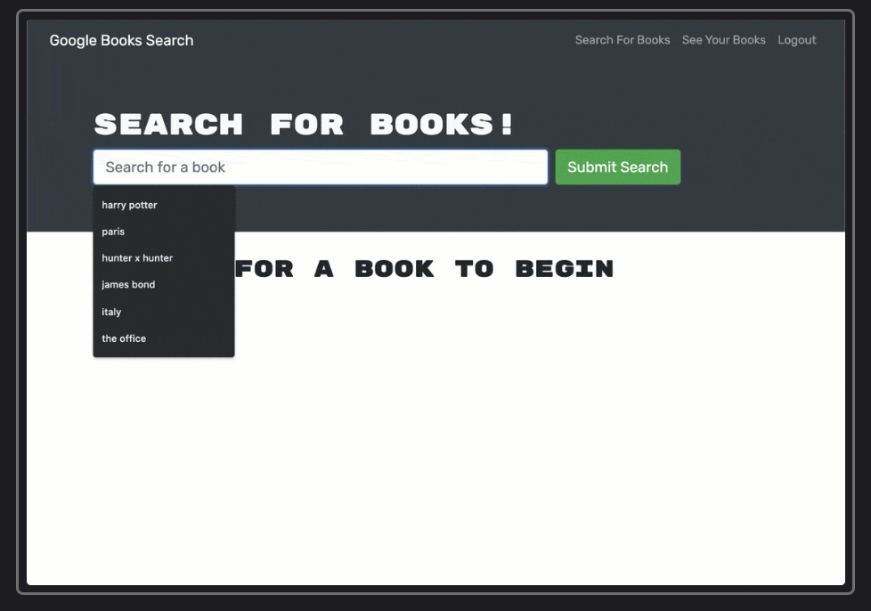

# Google Book Search Tool

## Description
Simple application built with React and GraphQL to search for and save book searches.

## Table of Contents
* [Installation](#installation)
* [Usage](#usage)
* [Contributors](#contributors)
* [Tests](#tests)
* [Questions](#questions)
* [License](#license) 

## Installation
To run locally, run npm install to install all the dependencies, then run npm run develop to run a local development server. To visit the live deployed version see the link below.

## Usage
Simple use case scenarios for book lovers. See screenshot below.  

## Contributors
None

## Tests
Tested with local development server.

Contact information (email address & GitHub username) of the developer
## Questions
kevin.o.foreman2@gmail.com || kevin-foreman (GitHub)

## License

The license used for this project is MIT

## Screenshot

## Deployed link
https://enigmatic-wave-67319.herokuapp.com/

